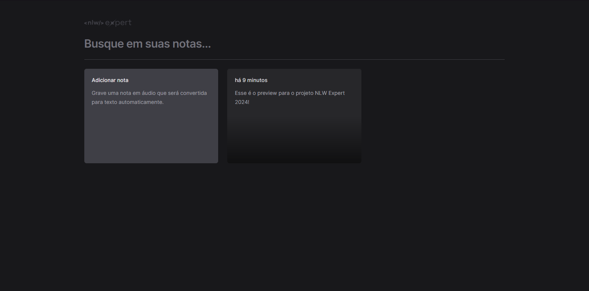

# NLW Expert Notes



## Descrição

Bem-vindo ao NLW Expert Notes, um aplicativo de notas desenvolvido durante o Next Level Week (NLW) Expert 2024 pela [Rocketseat](https://www.rocketseat.com.br/). Este projeto React oferece uma experiência interativa para criar notas por meio de texto ou áudio, onde o áudio é convertido automaticamente em texto.

[Link do Site](https://nlw-expert-notes-kappa.vercel.app)

## Tecnologias Utilizadas

- **Next.js**

- **Typescript**

- **Tailwind CSS**

- **Radix UI**

## Como Executar

1. Clone este repositório em sua máquina local.
2. Instale as dependências usando o comando:
   ```
   npm install
   ```
3. Inicie o aplicativo com:
   ```
   npm run dev
   ```
4. Abra o aplicativo no seu navegador.

## Contribuições

Contribuições são bem-vindas! Sinta-se à vontade para abrir problemas ou enviar pull requests.
